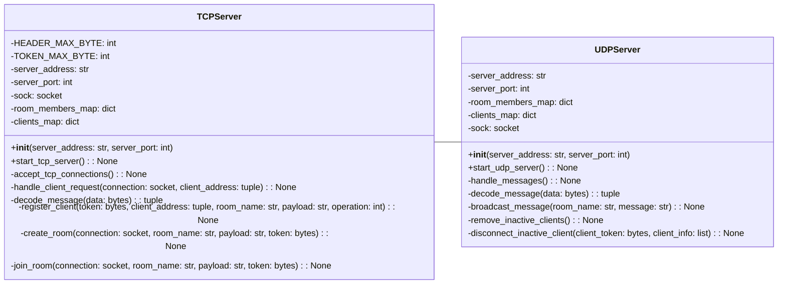
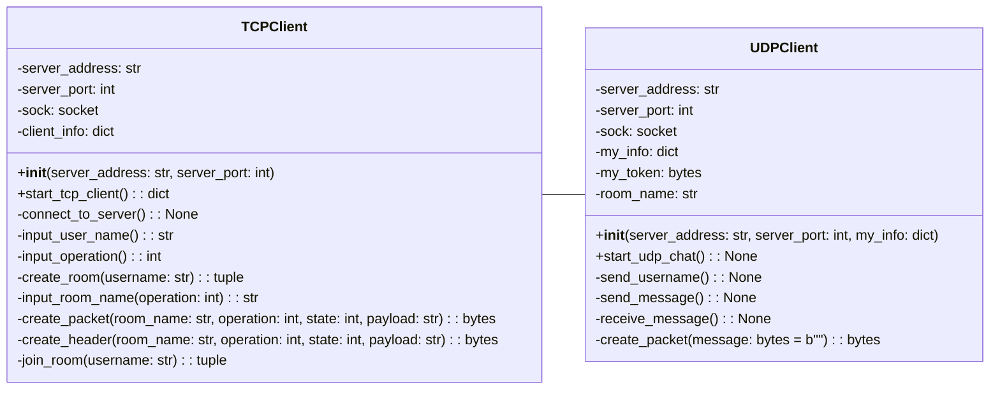
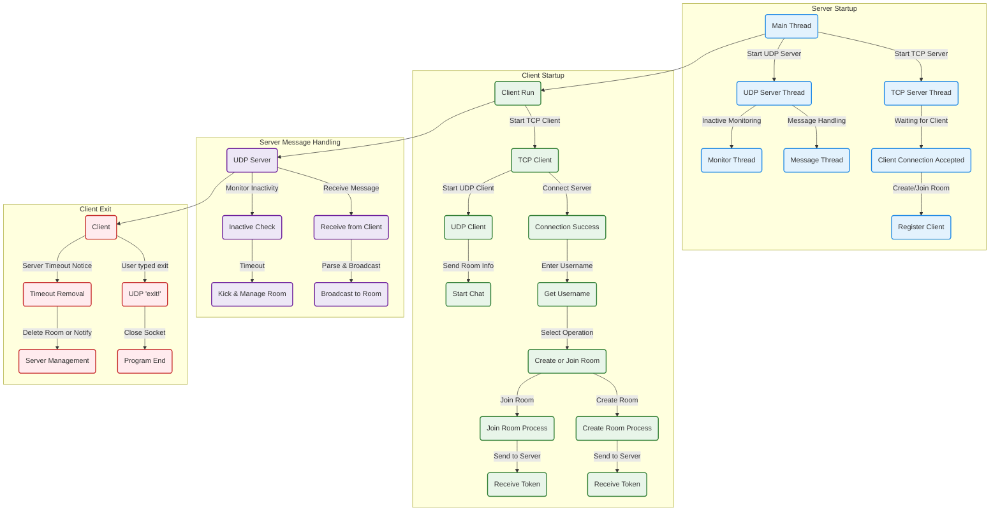

# 🌐 オンラインチャットサービス 💬  

## 🖥 シミュレーション


## 📌 目次
**このドキュメントの目次です。各セクションへジャンプできます。**

<hr style="border: 3px solid black;">

## **📎 概要**
- [概要](#概要)
- [シミュレーション](#シミュレーション)
- [実行方法](#実行方法)

---

## **🛠 技術関連**
- [使用技術](#使用技術)
- [機能一覧](#機能一覧)
- [クラス図](#クラス図)
- [処理フロー (フローチャート)](#処理フロー)

---

## **📍開発のポイント**
- [こだわりのポイント](#こだわりのポイント)
- [苦労した点](#苦労した点)
- [さらに追加したい機能](#さらに追加したい機能)

---

## **📄 参考情報**
- [参考文献](#参考文献)

---

## 🍀 概要
ユーザがルームを作成または参加して、グループチャットができるサービス

## 🖥 シミュレーション

## ▶️ 実行方法

## 🛠 使用技術

| カテゴリ | 技術スタック |
|----------|------------|
| 開発言語 | Python 3.13.2 |
| インフラ | Docker |
| その他 | Git, GitHub |


## ⚙ 機能一覧

## 📦 クラス図

### 1. server.pyのクラス図

### 2. client.pyのクラス図


## 🔀処理フロー (フローチャート)




## ✨ こだわりのポイント

## ⚠️ 苦労した点

## 💡 さらに追加したい機能

## 📄 参考文献
<p align="center">
  
</p>


# バイト情報


---

## 詳細仕様
- **新規チャットルーム作成時**
  - 操作コードは `1`
  - 状態は `0 → 1 → 2` の順に推移
  - TCPはトランザクションの完全性を保証するために使用
  - 状態の詳細：
    1. **状態 0（サーバの初期化）**: クライアントがルーム作成リクエストを送信（希望ユーザー名を含む）
    2. **状態 1（リクエストの応答）**: サーバはステータスコードを含むペイロードで即座に応答
    3. **状態 2（リクエストの完了）**: サーバがユニークなトークンをクライアントへ送信（トークンでユーザー名を識別）

- **既存チャットルームへの参加**
  - 操作コードは `2`
  - 状態遷移はルーム作成時と同じ
  - クライアントはトークンを受け取るがホストにはならない

---

## サンプルデータ
```json
{
    "operation": 1,
    "state": 0,
    "roomName": "ChatRoom01"
}
```

---

## 文字列の扱いについて
- `RoomName` は **UTF-8** でエンコード/デコードされる
- `OperationPayload` は操作と状態に応じて異なるフォーマット（整数、文字列、JSONなど）でデコードされる可能性がある

