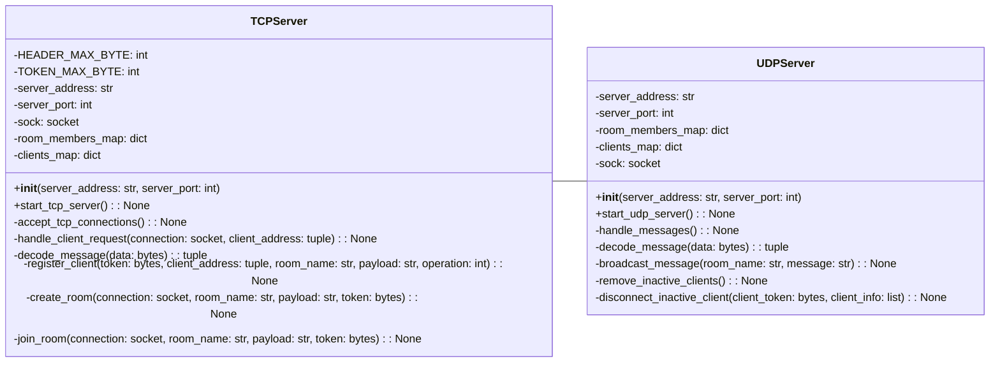
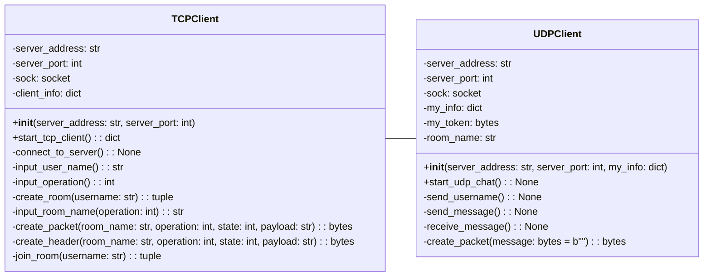
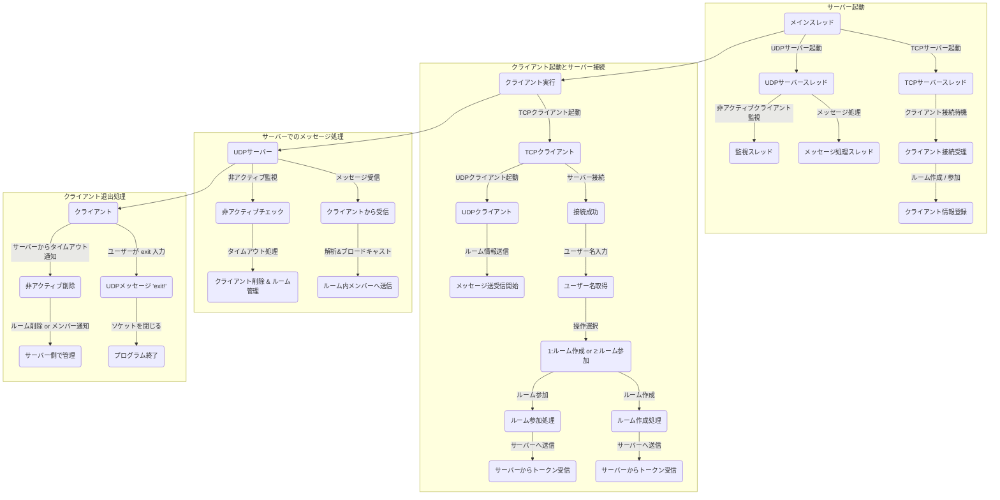

# 🌐オンラインチャットサービス💬  

## 🖥 シミュレーション


https://github.com/user-attachments/assets/f21b143b-4b1c-4df0-8399-a48202bb3576


## 📌 目次
**このドキュメントの目次です。各セクションへジャンプできます。**

<hr style="border: 3px solid black;">

## **📎 概要**
- [概要](#概要)
- [シミュレーション](#シミュレーション)
- [実行方法](#実行方法)

---

## **🛠 技術関連**
- [使用技術](#使用技術)
- [機能一覧](#機能一覧)
- [クラス図](#クラス図)

---

## **📍開発のポイント**
- [こだわりのポイント](#こだわりのポイント)
- [苦労した点](#苦労した点)
- [さらに追加したい機能](#さらに追加したい機能)

---

## **📄 参考情報**
- [参考文献](#参考文献)

---

## 🍀 概要
ユーザがルームを作成または参加して、グループチャットができるサービス

## 🖥 シミュレーション

## ▶️ 実行方法

## 🛠 使用技術

| カテゴリ | 技術スタック |
|----------|------------|
| 開発言語 | Python 3.13.2 |
| インフラ | Docker |
| その他 | Git, GitHub |


## ⚙ 機能一覧

## 📦 クラス図

### 1. server.pyのクラス図

### 2. client.pyのクラス図



## ✨ こだわりのポイント

## ⚠️ 苦労した点

## 💡 さらに追加したい機能

## 📄 参考文献
<p align="center">
  
</p>


# バイト情報

<table>
  <tr>
    <th>データ名</th>
    <th>説明</th>
    <th>状態</th>
    <th>バイト数</th>
    <th>型</th>
  </tr>
  <tr>
    <td><strong>RoomNameSize</strong></td>
    <td>ルームの許容人数</td>
    <td>-</td>
    <td>1バイト</td>
    <td><code>byte_int (0-255)</code></td>
  </tr>
  <tr>
    <td><strong>Operation</strong></td>
    <td>操作コードのこと</td>
    <td>1：ルームを作成する <br> 2：ルームに参加したい</td>
    <td>1バイト</td>
    <td><code>byte_int (0-255)</code></td>
  </tr>
  <tr>
    <td><strong>State</strong></td>
    <td>現在の状態のこと</td>
    <td>0：サーバの初期化（ルーム作成要求） <br> 1：リクエストの応答（ルーム作成中） <br> 2：リクエストの完了（ルーム作成完了）</td>
    <td>1バイト</td>
    <td><code>byte_int (0-255)</code></td>
  </tr>
  <tr>
    <td><strong>OperationPayloadSize</strong></td>
    <td>データ本体のこと</td>
    <td>-</td>
    <td>29バイト（RoomName: 8バイト + OperationPayload: 21バイト）</td>
    <td><code>byte_str</code></td>
  </tr>
</table>

---

## 詳細仕様
- **新規チャットルーム作成時**
  - 操作コードは `1`
  - 状態は `0 → 1 → 2` の順に推移
  - TCPはトランザクションの完全性を保証するために使用
  - 状態の詳細：
    1. **状態 0（サーバの初期化）**: クライアントがルーム作成リクエストを送信（希望ユーザー名を含む）
    2. **状態 1（リクエストの応答）**: サーバはステータスコードを含むペイロードで即座に応答
    3. **状態 2（リクエストの完了）**: サーバがユニークなトークンをクライアントへ送信（トークンでユーザー名を識別）

- **既存チャットルームへの参加**
  - 操作コードは `2`
  - 状態遷移はルーム作成時と同じ
  - クライアントはトークンを受け取るがホストにはならない

---

## サンプルデータ
```json
{
    "operation": 1,
    "state": 0,
    "roomName": "ChatRoom01"
}
```

---

## 文字列の扱いについて
- `RoomName` は **UTF-8** でエンコード/デコードされる
- `OperationPayload` は操作と状態に応じて異なるフォーマット（整数、文字列、JSONなど）でデコードされる可能性がある


